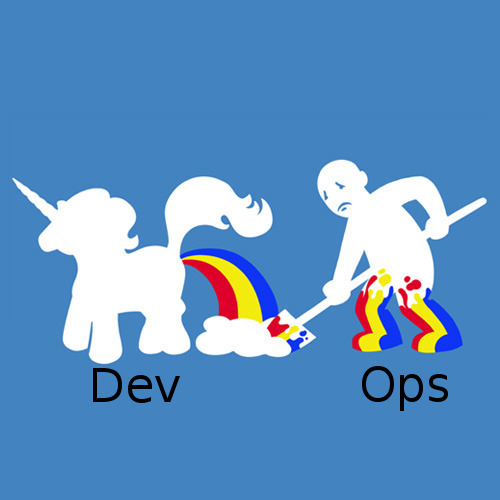
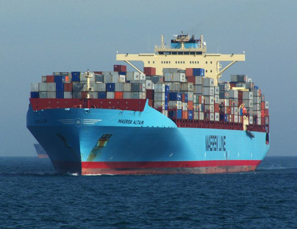
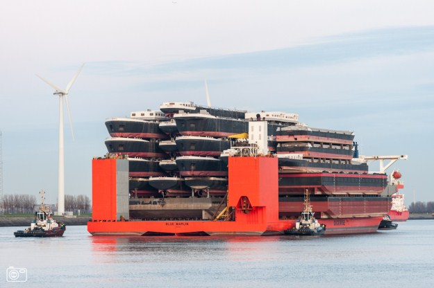
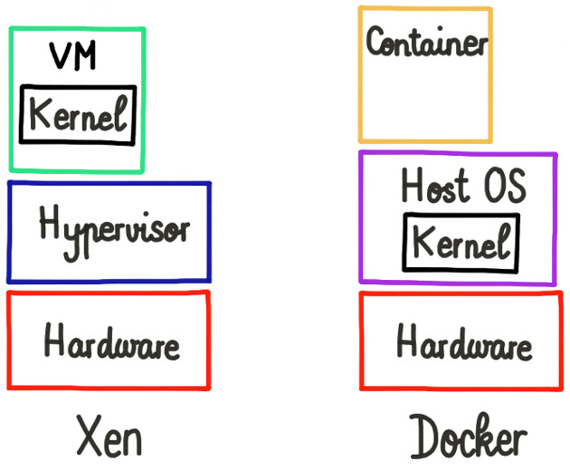
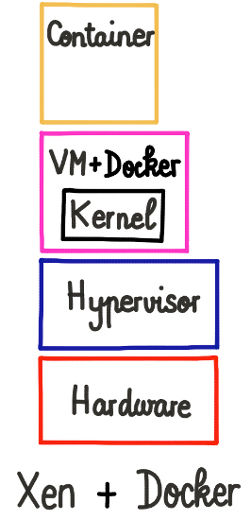
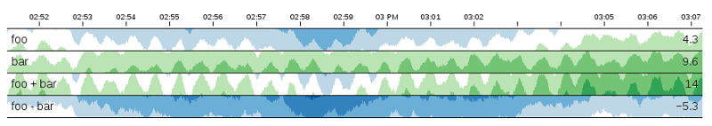

class: center, middle

# Xen and Docker

## Uniting best of both worlds

---

# Who am I?

* Olivier Lambert
* Xen Orchestra's project leader (https://xen-orchestra.com)
* Using Xen in production since 2007
* Met a lot of Xen sysadmins/ops

 
 
 

.center[]

---

# Introduction

* Why Xen?
  * mature (2003)
  * used in very large infrastructures (Amazon, Rackspace...)
  * I'm used to it

* Same principles for others (KVM, VMWare...)

.center[]

---

# Why this talk?

* Heard lot of ops/sysadmin worried by Docker
* We'll see why
* And how to answer this

.center[]
---

# Virtual machines

* IT usage revolution:
  * hardware abstraction
  * flexibility
  * resource control and isolation
  * resource delegation

---
# Virtual machines

As an ops, VMs are common stuff

* massive usage in the last 15 years
* we are used to it:
  * procedures
  * supervision
  * sized infrastructure
  * we control them

---

# Hypervisors

## Built for **ops** needs:

* live migration
* storage migration
* adjust VM resources in live (CPUs, RAM, disks)
* good isolation (security)
* run almost any OS on top of hypervisor
* lot of tools to administrate (CLI, GUI)

---

# Docker: (very) quick tour

* LXC Container + API to manage them
* out in 2013
* environment abstraction
* build for **devs** needs:

**Build, ship, and run any app, anywhere**

* it means for a dev:
  1. **something working on his laptop** running Docker...
  1. ...will work anywhere else!

---

# Devs first thought:

.center[]

---
class: center, middle

*No more extremist ops to convince for installing*

*{insert any controversial technology here}*

---
# Ops first thought

.center[]

---

# Why?

* Ops fears are:

  * blackbox syndrome (unknown container content)
  * performance impact on the infrastructure?
  * security impact?
  * maintenance?

Let's recap the **Ops** feeling:

### The power of a developer to push something unknown, anywhere*.

\*: where Docker is installed, of course.

---
class: center, middle

*"Whoops...!"*

---
class: center, middle

---

# Solution

If Docker is a boat shipping containers...

.center[]

---

# Solution

We'll do this:

.center[]

---

# Global architecture

.center[]

---

# Uniting powers

.center[]

---

# Results

* Bright side of Xen for **Ops**:
  * all VM flexibility/security package
  * no architecture change
  * Docker resources capped by your VMs...
  * ...but still modifiable in live
  * low overhead (< 10% max)

* **Devs** are happy:
  * they don't care what's underneath
  * they can play with Docker

---

# Is this new?

## Nope

1. The Xen+Docker architecture is common usage at Amazon Web Service
  * people create "classical" instances (AWS uses Xen)
  * they install Docker in it
  * tada! Xen+Docker

1. **Docker on top of Xen is here since Docker exists**

---

# Counter-arguments?

## Nope

Except:

* **very** specific cases (specific hardware or architecture)
* even the low Xen overhead is not possible

---

# Overcome the fear

1. **Ops**: understand Docker specificities by playing with some dev VMs
1. **Devs**: learn how to use Docker correctly, step by step
1. More teamwork together and/or have **Devops**

.center[]

*"Fear is the path to the dark side. Fear leads to anger. Anger leads to hate. Hate leads to suffering"*

---

# As an ops...

1. Start to dedicate VMs for Docker
  * play with it to understand basic principles
  * automatize (template/config) to deploy new Docker VMs quicker
  * start with dedicated VMs for dev environment

1. Gather metrics and trends
  * this way you'll understand what is going on
  * you'll recognize load/pattern behavior later in production

1. Extend the dev environment to test

1. Go in production

### These steps are done in parallel with your dev team

---

# As a dev...

1. Start to play with Docker on your own box
  * like **ops**, understand basic principles and workflow
  * learn best practices
  * Docker registry

1. Master your workflow in this dev environment (dev VMs)
  * teamwork with Docker
  * split your app in small bricks
  * Docker compose

1. Start to use it for continuous integration and tests
  * it should be painless, or you have problems
  * good experience before going live

1. **THEN** go in production

---

# No fear!

#### It's more a matter of workflow and human relationships than technology

#### Take your time! Remember how much time to master Virtual Machines?

#### ~1 year for a devs+ops team to master Docker workflow

---

# Room for improvements

More "glue" to integrate containers in existing VM tools/workflows:

* Map of the whole stack including containers (hypervisor/VM/container)
  * avoid the "all containers in one VM" effect
  * ensure a fair/intentional repartition

* Better metrics reporting of each container in a VM
  * discriminate a "problematic" container
  * adapt the VM resources if needed
  * open possibilities for more automation

---

# Everything is possible

* Docker has a great API
* "Bridges" started to appear recently (e.g: XenServer plugin connected to Docker API)
* Just need some lego works and imagination

.center[]

---

# More stack visibility

Live visualization (map) of the whole stack (host/VM/container):

.center[]

---

# More feedback

Advanced Docker metrics view inside a VM:

.center[]

* Running containers usage, cumulated (by metric)
* Container "color" depending of all resources usage

---

# Auto scaling

* Vertical scaling?
  * autoscale VMs perfs (CPUs/RAM etc.)
  * fine scaling by combining Xen and Docker usage
  * "like" Amazon ECS Service Scheduler but on your own hardware

* Horizontal scaling?
  * create Docker ready VMs on new/other servers (on demand)
  * Docker-driven VM deployment on specific set of resources
  * Docker orchestration tools (like Kubernetes) drivers for XenServer/Xen Orchestra
  * **DO NOT** reinvent the wheel, just focusing to deliver a consistent experience for **Ops** and DevOps without bothering devs (and *vice-versa*)

---

# Acknowledgements

* Jérôme Petazzoni (*Docker Inc.*)

* Lars Kurth (*Xen Project*)

---

# Questions?

.center[]
