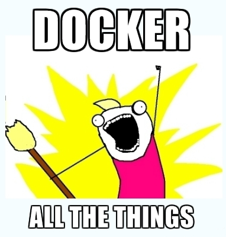

class: center, middle

# Xen and Docker

## Uniting best of both worlds

---

# Who am I?

* Olivier Lambert
* Xen Orchestra's project leader
* Using Xen in production since 2007
* Met a lot of sysadmins from everywhere

---

# Introduction

* Why Xen?
  * mature (2003)
  * used in very large infrastructures (Amazon, Rackspace...)
  * I'm used to it
* Same principles for others (KVM, VMWare...)
---

# Why this talk?

* Heard lot of ops/sysadmin worried by Docker
* We'll see why
* How to react

---

# Virtual machines

* IT usage revolution:
  * hardware abstraction
  * flexibility
  * resource control and isolation
  * resource delegation

---
# Virtual machines

As an ops, VMs are common stuff

* massive usage in the last 15 years
* we are used to it:
  * procedures
  * supervision
  * sized infrastructure
  * we control them

---

# Hypervisors

## Built for **ops** needs:

* live migration
* storage migration
* adjust VM resources in live (CPUs, RAM, disks)
* good isolation (security)
* run almost any OS on top of hypervisor
* lot of tools to administrate (CLI, GUI)

---

# Docker: quick tour

* LXC Container + API to manage them
* out in 2013
* environment abstraction
* build for **devs** needs:

**Build, ship, and run any app, anywhere**

* it means for a dev:
  1. **something working on his laptop** running Docker...
  1. ...will work anywhere else!

---
class: center, middle

# Devs first thought:

---
class: center, middle

*No more extremist ops to convince for installing*

*{insert any controversial technology here}*

---
class: center, middle

# Ops first thought

---

# Why?

* Ops fear this:
  * blackbox syndrome (unknown container content)
  * perf impact on the on infrastructure
  * security impact
  * maintenance?

Let's recap:

### The power of a developer to push something unknown, anywhere*.

\*: where Docker is installed, of course.

---

# Overcome the fear

3 complementary ways:

1. **Ops**: prepare your infrastructure for Docker workflow
1. **Devs**: learn how to use Docker correctly, step by step
1. More teamwork together and/or have **Devops**

---

# General architecture

Type 1 Hypervisor (left) / Container (right)

---

# Detailed architecture

Xen (left) / Docker (right)

---

# Together

# Is it bad together?

Previous slide: basically, Amazon Web Service.

**Docker on top of Xen is already done since Docker exists**

---

# As an ops...

1. Start to dedicate VMs for Docker
  * play with it to understand basic principles
  * automatize (template/config) to deploy new Docker VMs quicker
  * start with dedicated VMs for dev environment

1. Gather metrics and trends
  * this way you'll understand what is going on
  * you'll recognize load/pattern behavior later in production

1. Extend the dev environment to test

1. Go in production

### These steps are done in parallel with your dev team

---

# As a dev...

1. Start to play with Docker on your own box
  * like **ops**, understand basic principles and workflow
  * learn best practices
  * Docker registry

1. Master your workflow in this dev environment (dev VMs)
  * teamwork with Docker
  * split your app in small bricks
  * Docker compose

1. Start to use it for continuous integration and tests
  * it should be painless, or you have problems
  * good experience before going live

1. **THEN** go in production

---

# No fear!

#### It's more a matter of workflow and human relationship than technology

#### Take your time! Remember how much time to master Virtual Machines?

#### ~1 year to master Docker workflow

<!--
# Ideas

* history of Xen, context, purpose, ideas
* Docker tales : context, initial purpose, ideas

Clash? Devops

Intro : tout ce que tu dis sera soumis à validation par toi avant publication.

Questions :

* ptite histoire de comment t'es arrivé chez Docker ?

10/11 ans d'herbegement Xen + associé, pas rendu riche
VOIP, Web agency, etc.

Solmon Hykes rencontré pendant ces périgrinations

DotCloud : fourni des VM 2008 avec noyau custom pour eux
2010 : Californie, bosser sur DotCloud hosting et dev, automatisation

EC2, monitoring, capacity planning
2012 apogée DotCloud : dirige équipe Ops

Fin 2012 : refactoring DotCloud Début 2013

Pivot sur Docker

Début 2013 fin 2013 : fin dotcloud

Début 2014 : talk Docker

Mi 2014 : full time evengelist Docker

Études dev + taff dans l'ops
50% dev 50% ops

* profil sysadmin, comprendre pourquoi ça réagit sceptiquement à Docker
* quel contexte est né Docker ? petite histoire rapidement

automatisation DotCloud

Proto Docker 2008 basé sur OpenVZ
LXC super bas niveau, super ! Mais rien au dessus.

Haute densité, truc qui démarre vite, métriques, sécurité

Idée prendre des VM chez Jerome

* quel était l'objectif à l'origine ?

déployer vite dans l'hébergement
moins cher plus économe
client veut wordpress : paf en deux secs, provisionner vite

pour les devs : instance environnement de devs, sandbox

* objectif aujourd'hui ?

virtu : plus de problématique bas niveau
Docker : simplifier encore plus, découper les problemes, déployer du code

plus de question des logs,

Donner des moyens d'innovation aux devs

* avantages principaux today
* relation avec hyperviseurs ? comment perçu chez vous ?

Container ET VM
* présentation rapide de l'écosystème (très grandes lignes)
* features qui manquent vs XenServer ? migration à chaud sans stockage ? est-ce que ça a un sens ?
* intégration avec XO, Docker machine / Drivers ?

* Avenir de Docker ?

Docker experience dev = un peu nawak

1st phase : one app dev, docker+compose en LOCAL
2nd phase : horizontal + appli + workflow
3rd phase : integration continue

1 an -> devs

ops -> prise en main

OBJECTIF PRINCIPAL = pour les devs, la prod moins objectif

Slide docker pour les sysadmins

pas de mise en prod direct

Vision devs à l'arrach ou ops aveugle => jour au lendemain fait accompli

viz resources ressources et logs

vendre docker a des ops

containers metrics = sysdig http://www.sysdig.org/
faire ressortir metriques via API

carte infrastructure : tel conteneur sur tel hote, carte a plat

Docker is certainly the most influential open source project of the moment. Why is Docker so successful? Is it going to replace Virtual Machines? Will there be a big switch? If so, when?

Let's look at the past to understand the present and predict the future. Before virtual machines, system administrators used to provision physical boxes to their users. The process was cumbersome, not completely automated, and it took hours if not days. When something went wrong, they had to run to the server room to replace the physical box.

With the advent of virtual machines, DevOps could install any hypervisor on all their boxes, then they could simply provision new virtual machines upon request from their users. Provisioning a VM took minutes instead of hours and could be automated. The underlying hardware made less of a difference and was mostly commoditized. If one needed more resources, it would just create a new VM. If a physical machine broke, the admin just migrated or resumed her VMs onto a different host.

Finer-grained deployment models became viable and convenient. Users were not forced to run all their applications on the same box anymore, to exploit the underlying hardware capabilities to the fullest. One could run a VM with the database, another with middleware and a third with the webserver without worrying about hardware utilization. The people buying the hardware and the people architecting the software stack could work independently in the same company, without interference. The new interface between the two teams had become the virtual machine. Solution architects could cheaply deploy each application on a different VM, reducing their maintenance costs significantly. Software engineers loved it. This might have been the biggest innovation introduced by hypervisors.

A few years passed and everybody in the business got accustomed to working with virtual machines. Startups don't even buy server hardware anymore, they just shop on Amazon AWS. One virtual machine per application is the standard way to deploy software stacks.

Application deployment hasn’t changed much since the '90s though. Up until then, it still involved installing a Linux distro, mostly built for physical hardware, installing the required deb or rpm packages, and finally installing and configuring the application that one actually wanted to run.

In 2013 Docker came out with a simple, yet effective tool to create, distribute and deploy applications wrapped in a nice format to run in independent Linux containers. It comes with a registry that is like an app store for these applications, which I'll call "cloud apps" for clarity. Deploying the Nginx webserver had just become one "docker pull nginx" away. This is much quicker and simpler than installing the latest Ubuntu LTS. Docker cloud apps come preconfigured and without any unnecessary packages that are unavoidably installed by Linux distros. In fact the Nginx Docker cloud app is produced and distributed by the Nginx community directly, rather than Canonical or Red Hat.

Docker’s outstanding innovations are the introduction of a standard format for cloud applications, including the registry. Instead of using VMs to run cloud apps, Linux containers are used instead. Containers had been available for years, but they weren't quite popular outside Google and few other circles. Although they offer very good performance, they have fewer features and weaker isolation compared to virtual machines. As a rising star, Docker made Linux containers suddenly popular, but containers were not the reason behind Docker's success. It was incidental.

What is the problem with containers? Their live-migration support is still very green and they cannot run non-native workloads (Windows on Linux or Linux on Windows). Furthermore, the primary challenge with containers is security: the surface of attack is far larger compared to virtual machines. In fact, multi-tenant container deployments are strongly discouraged by Docker, CoreOS, and anybody else in the industry. With virtual machines you don't have to worry about who is going to use it or how it will be used. On the other hand, only containers that belong to the same user should be run on the same host. Amazon and Google offer container hosting, but they both run each container on top of a separate virtual machine for isolation and security. Maybe inefficient but certainly simple and effective.

People are starting to notice this. At the beginning of the year a few high profile projects launched to bring the benefits of virtual machines to Docker, in particular Clear Linux by Intel and Hyper. Both of them use conventional virtual machines to run Docker cloud applications directly (no Linux containers are involved). We did a few tests with Xen: tuning the hypervisor for this use case allowed us to reach the same startup times offered by Linux containers, retaining all the other features. A similar effort by Intel for Xen is being presented at the Xen Developer Summit and Hyper is also presenting their work.

This new direction has the potential to deliver the best of both worlds to our users: the convenience of Docker with the security of virtual machines. Soon Docker might not be fighting virtual machines at all, Docker could be the one deploying them.

-->
